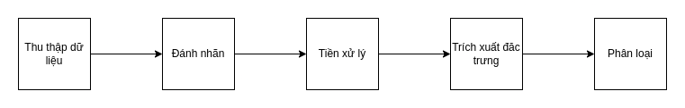

"Bạn vừa trúng một chiếc IPhone", "Ban là người may mắn thứ 101" những câu nói này nghe quen với bạn chứ. Trong bài viết
nhỏ này, mình sẽ hướng đẫn cách để tạo ra một hệ thống chống Spam nho nhỏ. Mình thấy bài viết cũng rất phù hợp với các
bạn muốn tìm hiểu về xử lý ngôn ngữ tự nhiên (NLP).

Để bạn có thể đọc bài viết một cách hiểu quả nhất việc biết 1 chút Python cũng như Google Colab chắc chắn là một lợi thế.
Nếu không thì các bạn cũng yên tâm, mình sẽ giải thích kĩ từng phần.

## Một chút chuẩn bị

Đối với các bạn nào chưa từng thử xử lý ngôn ngữ tự nhiên, thì mình nghĩ phần này có thể cho bạn một vài cái nhìn tổng
quát về những thứ mình chuẩn bị làm. Với các bạn đã nắm sơ ý tưởng, ta có thể xem từ chương kế tiếp.

Trước hết cùng mình phân tích đề tài này nha. Việc chặn Spam thực chất qui về việc xác định một đoạn Text là Spam. Oki,
có vẻ hợp lý nhưng làm sao để xác định đây là Spam nhỉ? Thì xác định Spam có thể hiểu là phân dữ liệu thành những tin
nhắn Spam và không Spam (mà mình tạm gọi là Ham).

Oki vậy chắc bạn sẽ thắc mắc thế nào là Spam, nào là Ham. Thú thật mình cũng không có câu trả lời đâu 😅, mà thực ra
việc hệ thống bạn xác định đó Spam hay không phụ thuộc vào việc đánh nhãn mà mình sẽ nói ở dưới, nên nếu bạn cần tìm
tiêu chí để xác định Spam hay Ham thì bạn có thể hỏi người đánh nhãn nha 😅. Vì vậy có cơ hội bạn nên trưc tiếp thu
nhập dữ liệu và đánh nhãn nha.

Để thực hiện việc phân loại dữ liệu dạng Text thì xử lý ngon ngữ tự nhiên thường theo một qui trình như sau: 

Cùng mình đi qua cái quy trình này xíu nha. Thu thập dữ liệu, đây là bước tiên quyết mà bạn cần phải làm, lý do là vì
dữ liệu là đầu vào của việc huấn luyện. Đánh nhãn, đây cũng là một bước cực kì quan trọng, do dữ liệu bạn thu nhập
được ở bước 1 không đủ thông tin để có thể Training được, nó cũng giống như bạn in sách giáo khoa và bỏ hết đề mục
vậy.

Tin mình đi, nếu bạn làm được 2 bước này là bạn đã làm hết những việc nặng rồi đó do nó thường tốn rất nhiều thời gian.
Vì lý do này những trang Web lưu dữ liệu được đánh nhãn sẳn ra đời như [Kaggle](https://www.kaggle.com/), nhờ đó giảm
bớt thời gian khi bạn cần thực hiện những Task dơn giản.

Ta tiếp tục với việc tiền xử lý, dù dữ liệu đã được đánh nhãn, thông tin trong dữ liệu đó vấn chứa những thông tin nhiễu
cũng như đôi khi dữ liệu quá lớn cũng làm chậm quá trình huấn luyện. Tiền xử lý giúp ta loại bớt thông tin không cần thiết
từ đó đạt được dữ liệu tốt hơn cũng như nhẹ hơn.

Từ nãy tới giờ, chúng ta vẫn chưa hề liên kết các thông tin lại với nhau, các đoạn Text đối với máy tính đều rời rạc 
nhau. Để giải quyết vấn đề này ta cần làm bước trích xuất dữ liệu mà thực chất là liên kết các từ cũng như các đoạn
Text với nhau để tìm ra đặc trưng. Ngoài việc tìm đặc trưng thì ta cũng cần cái đầu ra là những Vector để có thể tiếp
tục bước kế tiếp.

Bước cuối cùng có vẻ khó nhất nhưng thực ra ta thường thực hiện rất nhanh đó là việc phân loại đự vào đặc trưng mà ta
tìm đuọc ở bước trên.

## Bắt đầu thôi

### Chuẩn bị dữ liêu có nhãn

### Tiền xử lý

### Trích xuất đặc trưng

### Phân loại

## Chốt sổ nào
